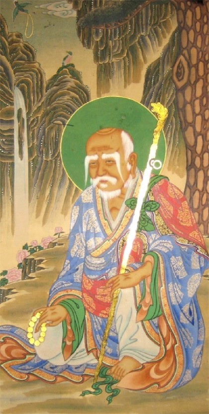

### 정의

- 우리나라 불교에서만 독성각 또는 삼성각 에 봉인해 신앙대상으로 삼는 불교성자. `독성수 • 독성존자`

### 정리

> 나반존자라는 명칭은 석가모니의 10대 제자나 5백나한의 이름 속에보이지 않고, 불경 속에도 그 명칭이나 독성이 나반존자라는 기록을 찾아볼수 없으며, 중국의 불교에서도 나반존자에 대한 신앙은 생겨나지 않는다.

`나반존자에 대한 신앙은 오직 우리나라에서만 찾아볼수 있는 신앙형태이다.`
