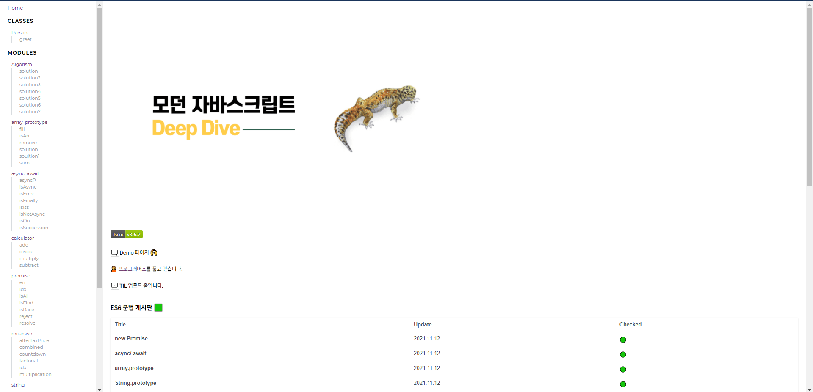

 
 
# TIL(Today I Learned) 기록 2021.11.12

### **dir**
```sh
JS-Docs
├── docs
├── src
└── tutorials
```

- 예전부터 계획했던 프로젝트 하나였던 `JsDocs` 플러그인  설치후 
기본적인 자바스크립트 `Basic` 방식들 과 `알고리즘` 을 방식들을 
공부를 하고 싶어서 조금씩 조금씩 만들게 되었으며 
-가장 중요한 핵심 3가지는 Clean code 에서 `가독성` `가독성` `가독성` 이라는 말을 강조 하듯이 가독성 과  기본적인 문법 및 간략한 코드를 만들기 연습 하고  있다. 
아직은 정말 많이 무지하고 부족하다..

#### 알고리즘  제일 작은수 제거하기 
- 제일 헷갈렸던 `reduce`  반복함수 및 `filter` true 인 요소로만 구성된 새로운 배열을 반환 
- 알고리즘들을 문제를 풀어보면서 조금씩 ES6문법 `Array.prototype` 요소들을  제대로 알기 시작하였고, 눈에 보이기 시작했다. 

```tsx
function solution(arr) {
   if(arr.length <= 1) return[-1]
    let idx 
    arr.reduce((pre,cur)=> idx = cur > pre ? pre: cur)
    return arr.filter(e =>e !== idx )  
}
```


