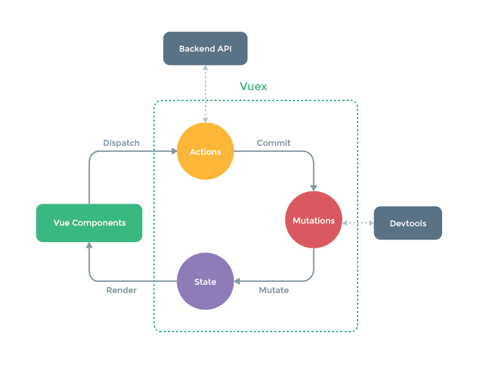

# Vuex 란

- 어플리케이션의 모든 컴포넌트들에 대한 중앙 집중식 저장소의 역할 및 관리
- Vuex 는 vue.js 애플리케이션 에대한 상태관리패턴 + 라이브러리

## Vuex 구조

Vuex는 `state` `mutations` `action` `getters` 4가지 형태로 관리가 되며,
관리 포인트 'store' 라고 불리며, 이 4가지 는 단방향 데이터 흐름  
 `(SPA(Single Page Aplication))`

### state

Vue 컴포넌트 에서 data 불릴수 있으며 `state: () => ({ a:123, b:[] })` 화살표 함수를 사용한다.

### mutations

**비동기 작업이 불가능하다 와 직접적으로 호출이 불가능하다.** mutatation 은 state 를 변경하는 유일한 방법이다 첫번째 인자로 써는
`state` 를 받을수 있으며, 두번째 인자는 `payload`를 받는다 payload 는 여러필드를 포함할수 있는
객체형태도 가능하다. 직접호출이 불가능해 `commit`을통해 호출할수있다 .

```tsx
updateState (state, payload) {
    Object
      .keys(payload)
      .forEach(key => {
        state[key] = payload[key]
      })
  }
```

### actions

**비동기 작업이 가능하다** action는 mutation 에 대한 commit 이 가능하여
commit이 가능하여 action에서도 mutation을 통해 state를 변경할 수 있다.
action 첫번째 인자를 `context` 인자 받으며, 인자 는 총 4가지 로써 `state` `commit` `dispatch` `rootstate`
를 속성을 받을수가 있다 두번째인자는 `payload`를 받는다.

```tsx
//todoApp 예제 소스코드 입니다.
clearCompleted ({ state, commit, dispatch }) {
    // Lodash 라이브러리 활용
    _forEachRight(state.todos, todo => {
      if (todo.done) {
        dispatch('deleteTodo', todo)
      }
    })
  }
```

### Getters

**Vue 컴포넌트에서 computed 로 볼수가 있다** 그리고 getter 의 결과는 종속성 따라 캐쉬 되고,
일부 종속성 이 변경된 경우에만 다시 재계산 된다. Getters는 첫번째 전달인자로 `state` 를 받는다.

```tsx
const store = new Vuex.Store({
  state: {
    todos: [
      { id: 1, text: '...', done: true },
      { id: 2, text: '...', done: false },
    ],
  },
  getters: {
    doneTodos: state => {
      return state.todos.filter(todo => todo.done)
    },
  },
})
```

두번째로 인자로는 다른 getter 를 전달 받고, getter 를 사용하여 다른 getter 를 사용할수가 있다.

### modules

- Vuex는 저장소를 `모듈` 로 나눌수가 있다 각 모듈은 자체 상태,변이,액션,게터 밒 심지어 중첩된 모듈을 포함할수가 있다

네임스페이스 를 기본적으로 모듈 내의 액션 변이 및 여전히 `전역 네임 스페이스` 이래에 등록아 된다.
모듈이 독립적이거나 재사용 되기를 원하면 `namespaced:true`라고 명시를 해줘야한다.

```tsx
modules: {
  todoApp
}
```

## store `state` `commit` `dispatch` `rootstate` 사용한 예제입니다.

```tsx
export default {
  namespaced: true,
  //Data 매칭 하는 개념이다.
  state: () => ({
    a: 123,
    b: [],
  }),
  // computed  같은개념

  getters: {
    someGetter1(state, getters) {
      return state.a + 1
    },
    // 여기에서 보여준 다른 Getters 선언
    someGetter2(state, getters) {
      return state.a + getters.someGetter1
    },
  },
  // payload
  mutations: {
    someMutation(state, payload) {
      state.a = 789
      state.b.push(payload)
    },
  },
  //context 는 state,getters,commit,dispatch  총 4가지를 사용할수가있다
  actions: {
    someAction1({ state, getters, commit, dispatch }, payload) {
      state.a = 789 //Error
      // state.b.push(payload) Error
      commit('someMutation', payload)
    },
    someAction2(context, payload) {
      context.commit('someMutation')
      context.dispatch('someAction1', payload)
    },
  },
}
```

### 정리한 이유

> 1.Vuex Store 에 대해 기본적으로 알아야 하기위해 정리를 해보았습니다! 2.모르는것들을 재정바후 다시 공부를할때 제대로 알기위해 적어놓았습니다.

- [참조] : [Vuex](https://vuex.vuejs.org/kr/guide/getters.html)
