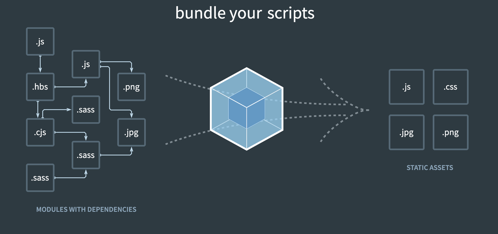

## **handlebars**

1. handelbar 를 HTML로 컴파일 이가능하다.  
   2.문법이 깔끔하다  
   3.확장자(.hbs)를 가지고 컴파일 과정을 거친다.

```tsx
//template.hbs
<title>Webpack {{htmlWebpackPlugin.options.title}}</title>

//webpack.common.js
new HtmlWebpackPlugin({
      title: "Webpack",
      template: "./template.hbs",
      meta: {
        ViewPort: "width=device-width ,inital-scale=1.0"
      },
      minify: isProduction
        ? {
            collapseWhitespace: true,
            useShortDoctype: true,
            removeScriptTypeAttributes: true
          }
        : false
    })

```

---

## **Caching**

### **Web Application**

- 사용자가 서비스를 이용하기 위해 기다리는 시간을 최소화하기 위해 사용되는 것 `캐싱`

### **캐싱(Caching))**

- 리소스 의 복사본을 놓고 서버보다는 가까운 위치에 놓고,클라이언트에서 사용할 수 있게끔한다.
- 사용자 에게 훨씬 빨리 리소스를 전달하고 서버로 요청하는 횟수가 줄어 부하가 줄어든다.

### **Caching & Webpack**

- 웹팩이 번들파일을 만드는과정에서 caching을 효과적으로 사용하는방법
- 모듈들을 번들파일로 만들면, 브라우저는 번들파일을 받고, 웹 어플리케이션으로 동작시킴
- 파일이 번들링 될때에만 `hash`값을 변경
- 해시값 : `hash`,`contenthash`,`chunkhash`  
  [참고문서](https://webpack.kr/guides/caching/) Caching 에 관련한 문서입니다.

### Minification & Mangling

1. **Minification**

- `Production mode` 에서는 기본으로 코드를 최소화합니다.
- `TerserPlugin`은 최소화를 시작하고 기본으로 시작할수가있다.

#### css최적화

- 강의들으면서 공부했을때 외부로 받아서 공부한코드내용입니다.

```tsx
 new OptimizeCssAssetsPlugin({
      assetNameRegExp: /\.css$/g,
      cssProcessor: require("cssnano"),
      cssProcessorPluginOptions: {
        preset: ["default", { discardComments: { removeAll: true } }]
      },
      canPrint: true
    }),
```

-웹팩이 기본적으로 채택하는 terser 를 이용하여 사용하였습니다.

```tsx

minimizer: [
      new TerserWebpackPlugin({
        cache: true
      })
    ]
  },
```

---

## **mode**

- mode 옵션을 사용하면 `webpack`에 내장된 최적화 기능 을 사용할수가있다.

```tsx
module.exports = {
  mode: 'development',
}
```

|    Template     | Description                                                                                                                                                                                                                                                        |
| :-------------: | ------------------------------------------------------------------------------------------------------------------------------------------------------------------------------------------------------------------------------------------------------------------ |
| **development** | DefinePlugin의 `process.env.NODE_ENV`를 development로 설정합니다. 모듈과 청크에 유용한 이름을 사용할 수 있습니다.                                                                                                                                                  |
| **production**  | DefinePlugin의 process.env.NODE_ENV를 production으로 설정합니다. 모듈과 청크, FlagDependencyUsagePlugin, FlagIncludedChunksPlugin, ModuleConcatenationPlugin, NoEmitOnErrorsPlugin, TerserPlugin 등에 대해 결정적 망글이름(mangled name)을 사용할 수 있습니다.해시 |
|    **none**     | 기본 최적화 옵션에서제외                                                                                                                                                                                                                                           |

[mode 문서참고](https://webpack.kr/configuration/mode/#root)

### 이미지 파일 모듈 (file-loader), (url-loader)

- 모듈내에서 import나 require 로 사용하고자 하는 file을 모듈을 읽어들일수 있도록 하는 loader
- file-loader 로 읽은 파일의 경우,build시 outputr dir 경로로 파일을 카피해오는 역할입니다.

```tsx
 {
        test: /\.(png|jpe?g|gif)$/i,
        use: [
          {
            loader: "file-loader",
            options: {
              name() {
                if (!isProduction) {
                  return "[path][name].[ext]"
                }
                return "[contenthash].[ext]"
              },
              publicPath: "assets/",
              outputPath: "assets/"
            }
          }
        ]
      }


      {
        test: /\.svg$/,
        use: [
          {
            loader: "url-loader",
            options: {
              limit: 8192   //  limit 8바이트 이상 이면 불가 하다 .
            }
          }
        ]
      },
```

## sass -loader

- SASS: css작성시 가독성 높은 표현법 사용, 다양한 문법 제공(css 확장된 형태)
- SASS를 사용하는 경우, SASS파일을 css파일로 변환하는 과정을 거쳐야한다

```tsx
    {
        test: /\.s?css$/i,
        oneOf: [
          {
            test: /\.module\.s?css$/,
            use: [
              {
                loader: MiniCasExtractPlugin.loader
              },
              {
                loader: "css-loader",
                options: {
                  module: true
                }
              },
              postcssLoader,
              "sass-loader"
            ]
          },
```

### PostCss

- css를 위해 사용되는 도구
- js 를 플러그인 추가해서, css 목적에 맞게 변화시켜준다.

- 원하는 목적에 맞는 플러그인을 찾고 Post css 를 적용시킨다.

#### **auto prefixer**

- vendor-prefixer
- 각 웹브라우저사 별로 스펙에 대한 개발을 진행
- vendor-prefixer를 사용함으로써, 최신에 제공되는 기능들도, 하위브라우저에서 안전하게 사용할 수 있다.

```
const postcssLoader = {
  loader: "postcss-loader",
  options: {
    postcssOptions: {
      path: "postcss.config.js"
    }
  }
}
```

- postcss 나 플러그인은 항상 그러하듯이 `문서참고`후에사용하는것이 좋습니다.!
  > [postcss](https://postcss.org/)

## blowsers list

- 지원하고자하는 브라우저에 대한 설정

#### 설정방법

- package.json에 정의하는 방법(권장)
- .browserslistrc 파일에 정의
- js 모듈로 만들어서 browserslist값을 관리할 수도 있음 (postcss.config.js처럼)

### **실습**

```tsx
  "browserslist": [
    "last 2 versions", // 각 브라우저별 최신버전
    "IE 10", //특정브라우저에 대한 특정 버전
    "Firefox > 20 " // Firefox에 대한 버전을 20 이상인 버전지원
  ]
```

## Stylelint

- 코드를 작성하다보면. 비즈니스에 몰두한 나머지 일관된 코드를 구현하지 못할때가 있다.
- `stylelint`,`stylelint-config-standard`

#### **모듈설치**

```tsx
npm i -D stylelint stylelint-scss stylelint-webpack-plugin stylelint-config-standard
```

#### .stylelintrc

```tsx
{
  "extends":"stylelint-config-standard"
}
```

## Babel

- 일부 css 기능들은 하위 브라우저에서 사용할수 없는 기능들이기 때문에 ,
  하위 브라우저를 호환하기 위해
- **Babel**
- ES6+코드를 하위버전 코드로 transpiling 하기 위한 도구

### **실습**

```tsx
{
        test: /.js/,
        exclude: /node_modules/,
        loader: "babel-loader"
}

//babel.config.js
module.exports = {
  presets: ["@babel/preset-env"]
}

```

#### 모듈설치

```tsx
npm i @babel/cli @babel/core @babel/preset-env babel-loader -D
npm i @babel/polyfill -D
```

[babel-loader](https://webpack.js.org/loaders/babel-loader/) 문서입니다.

> webpack config 를 정리한이유 를 문서를 보는것도 좋지만
> 큰틀의 흐름을 잡기위해 조금 오래 정리하게 되었습니다.
