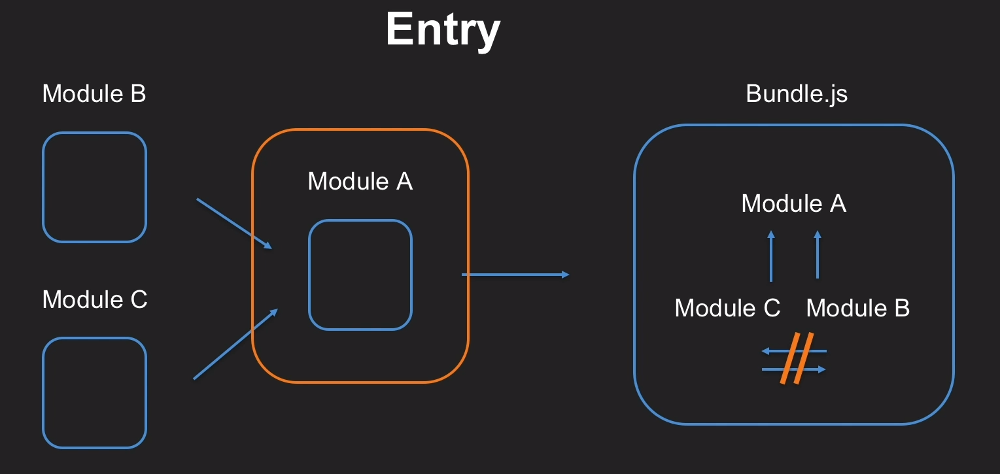

> 1.웹팩의 기본구조: entry,output,loader,plugin,mode

## entry



- **entry**
- 모듈의 의존관계를 이해하기위한 시작점
- 웹팩에서 웹자원을 변환하기위한 최초 진입니점 및 자바스크립트 경로 로 할수가 있다.

```tsx
entry: './index.js '
```

## output

- **output**
- 최상위 `output` 키에는 번들,애셋 및 `webpack`으로 번들링하거나 로드하는 기타 항목을
  출력하는 방법과 위치를 `webpack`지시하는 옵션이 포함되어있다.

```tsx
 output: {
    filename: "[name].[hash].js", //hash,contenthash,chunkhash
    path: path.resolve(__dirname, "dist")
  },
```

|    Template     | Description                               |
| :-------------: | ----------------------------------------- |
|    **hash**     | 모든 식별자 의 해시                       |
|  **chunkhash**  | 청크의 모든요소를 포함한 청크의 해시      |
| **contenthash** | 콘텐츠타입 의 요소만 포함하는 청크의 해시 |

## loader

- **loader**

1. 웹팩이 웹 APP을 해석할때 JS파일이 아닌 웹 자원 (HTML,CSS,assets,font) 변환할때 도와주는 속성
2. 다양한 모듈들을 입력받아 처리하는 역할
3. 웹팩이 기본적으로 인식하는 모듈형태는 js, json파일이기 때문에 다른 타입의 모듈들은 개별적으로 loader를 준비해서, 웹팩에 연결해야한다.

```tsx
rules: [
  {
    test: /\.css$/i,
    use: [
      // {
      //   loader: "style-loader",
      //   options: {
      //     injectType: "singletonStyleTag"
      //   }
      // },
      { loader: MiniCasExtractPlugin.loader },
      {
        loader: 'css-loader',
        options: {
          modules: true,
        },
      },
    ],
  },
  {
    test: /\.hbs$/,
    use: ['handlebars-loader'],
  },
]
```

- `rules`: 지원해야하는 모듈타입을 들을 위해 필요한 로더들을 설정하는 공간
- `test` : 로더 적용할 파일 유형
- `use` : 해당파일에 적용할 로더의 이름

- 로더의 종류
- 대표적으로 사용해본 로더
- `handlebarsloader`, `css-loader`,`sass-loader`,`postcss-loader`,`babel-loader` 로더들의 정리내용도 글정리 할예정입니다.
  > [loader](https://v4.webpack.js.org/loaders/#root)✔️ 다양하게 정리해놓은 문서들입니다. 항상 버전은 달라지고 문서 보는방법은 항상체크

## plugin

- 웹팩의 기본동작에 추가기능 제공하는속성
- 번들파일에 변화를 주기도 하며, 개발모드의편의성 ,production모드 에서 코드 의 최적화 하는 등의 역할 을 할수가있다 .

```tsx
 plugins: [
    new MiniCasExtractPlugin({
      filename: "[contenthash].css"
    }),
    new OptimizeCssAssetsPlugin({
      assetNameRegExp: /\.css$/g,
      cssProcessor: require("cssnano"),
      cssProcessorPluginOptions: {
        preset: ["default", { discardComments: { removeAll: true } }]
      },
      canPrint: true
    }),
    new HtmlWebpackPlugin({
      title: "Webpack",
      template: "./template.hbs",
      meta: {
        ViewPort: "width=device-width ,inital-scale=1.0"
      },
      minify: {
        collapseWhitespace: true,
        useShortDoctype: true,
        removeScriptTypeAttributes: true
      }
    }),
    new CleanWebpackPlugin()
  ],
```

- **사용한 예제 플러그인 정리**  
  -`MiniCasExtractPlugin`:이 플러그인은 CSS를 별도의 파일로 추출합니다. CSS가 포함된 JS 파일별로 CSS 파일을 생성합니다.
- `OptimizeCssAssetsPlugin`: css 자산을 최소화 하는 Webpack 플러그인입니다.
- `HtmlWebpackPlugin`: 번들러 를 위한 HTML파일을 자동으로 만들고 설정해준다.
- `CleanWebpackPlugin`: 빌드 이전 결과물을 제거하는 플러그인 이다.

## mode

- **mode**
- 프로덕션 환경과 개발환경
- `dependencies`: 어플리케이션 내부에 직접 포함되는 모듈

```tsx
npm i
```

- `devDependencies`: 개발과정에 필요한 모듈
  개발 효율을 높이거나, 코드의 컨벤션 검사, 개발자 코드의 품질 높이는 등 개발 자체에 영향미치는 모듈

```tsx
npm i -D
```

### 명령어 설정

- 환경변수 등록후에 프로젝트 패키지 관리 파일인 `package.json` 을 손쉽게 명령을 실행해 원하는 모드에 따라 `start`,`dev`,`build`를 수행을 할수가있다 .

```tsx
"scripts": {
    "start": "cross-env NODE_ENV=DEVELOPMENT webpack-dev-server  --config webpack.dev.js",
    "dev": "NODE_ENV=DEVELOPMENT webpack --config webpack.dev.js",
    "build": "NODE_ENV=PRODUCTION webpack --config webpack.prod.js"
  },
```

> 웹팩의 기본구조 를 정리하면서 공부했던부분들을 큰틀을 잡혀있을수 있어서 좋았고.  
> 세밀한 부분들을 정리해서 올릴생각입니다.

- [참고문서](https://v4.webpack.js.org/) **webpack 4** 버전 문서내용입니다.
