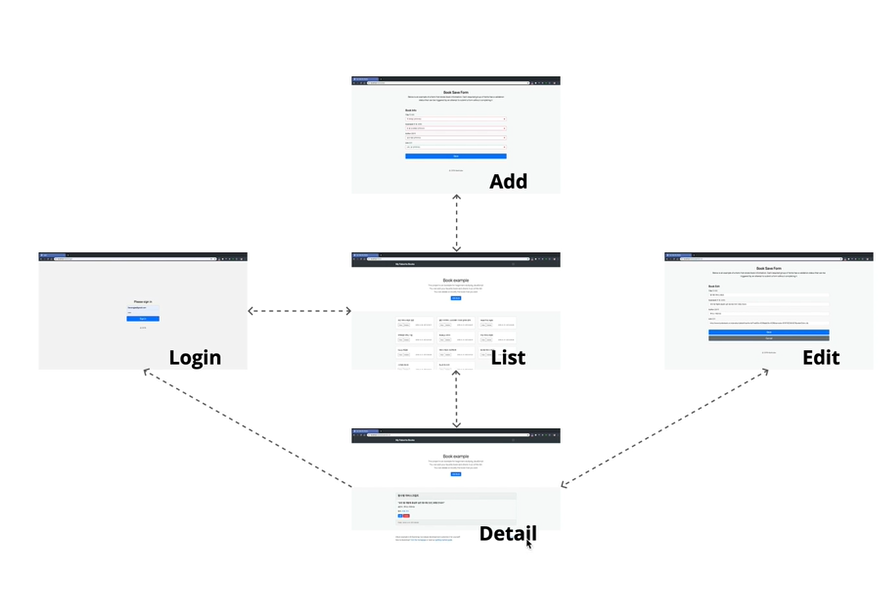

- 예제를 사용하면서 미니 프로젝트를 진행해보았습니다. axios 사용한 JS CRUD 이며,
- **Authorization** : API에 접속하기 위해서는 access token을 API 서버에 제출해서 인증을 해야 합니다.
- 글을 정리중입니다.

```tsx
async function getBook(bookId) {
  const token = getToken()
  if (token === null) {
    location.assign('/login')
    return null
  }
  try {
    const res = await axios.get(`https://api.marktube.tv/v1/book/${bookId}`, {
      headers: {
        Authorization: `Bearer ${token}`,
      },
    })
    return res.data
  } catch (err) {
    console.log('getBook Error', err)
    return null
  }
}
async function logout() {
  const token = getToken()
  if (token === null) {
    location.assign('/login')
    return
  }
  try {
    await axios.delete('https://api.marktube.tv/v1/me', {
      headers: {
        Authorization: `Bearer ${token}`,
      },
    })
  } catch (error) {
    console.log('logout error', error)
  } finally {
    localStorage.clear()
    location.assign('/login')
  }
}
```

> 예제 보면서 공부해보았던 예제 입니다. 글을 쓰는이유

> [데모페이지](https://faboritebooks.netlify.app) 예제입니다.
